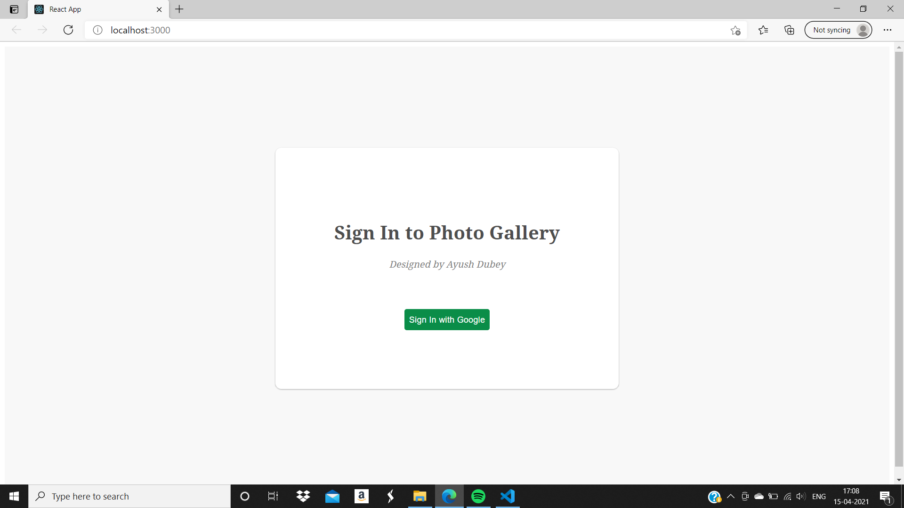
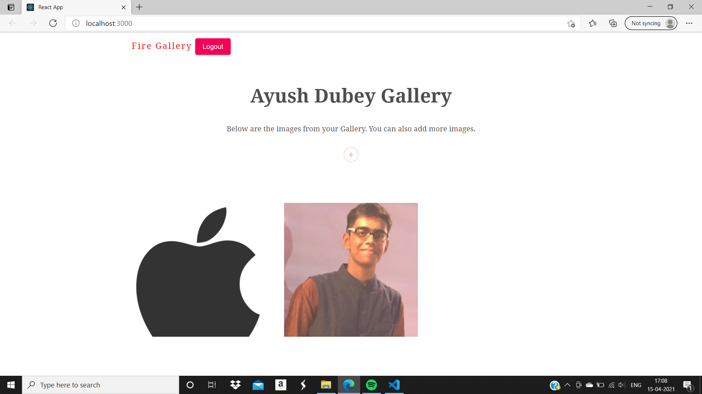
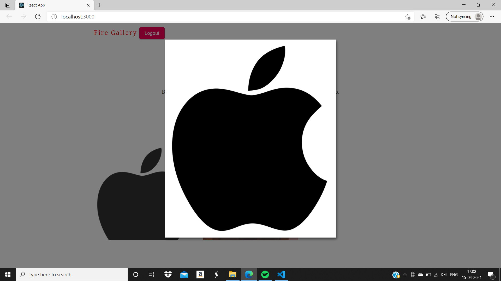

# User-Photo-Gallery 📸📁
This is a photo gallery app built on React using firebase. 

> ## Code Output:
 

> ### User Sign-In:

> ### HomePage:

> ### Image-Modal:

> ### Packages to be installed:

`npm install`:

    "@material-ui/core": "^4.11.3"
    "@testing-library/jest-dom": "^5.11.8"
    "@testing-library/react": "^11.2.2"
    "@testing-library/user-event": "^12.6.0"
    "bootstrap": "^4.5.3"
    "firebase": "^8.2.1"
    "framer-motion": "^3.1.1"
    "react": "^17.0.1"
    "react-bootstrap": "^1.4.0"
    "react-dom": "^17.0.1"
    "react-firebase-hooks": "^3.0.3"
    "react-router-dom": "^5.2.0"
    "react-scripts": "4.0.1"
    "styled-components": "^5.2.3"
    "web-vitals": "^0.2.4"`
